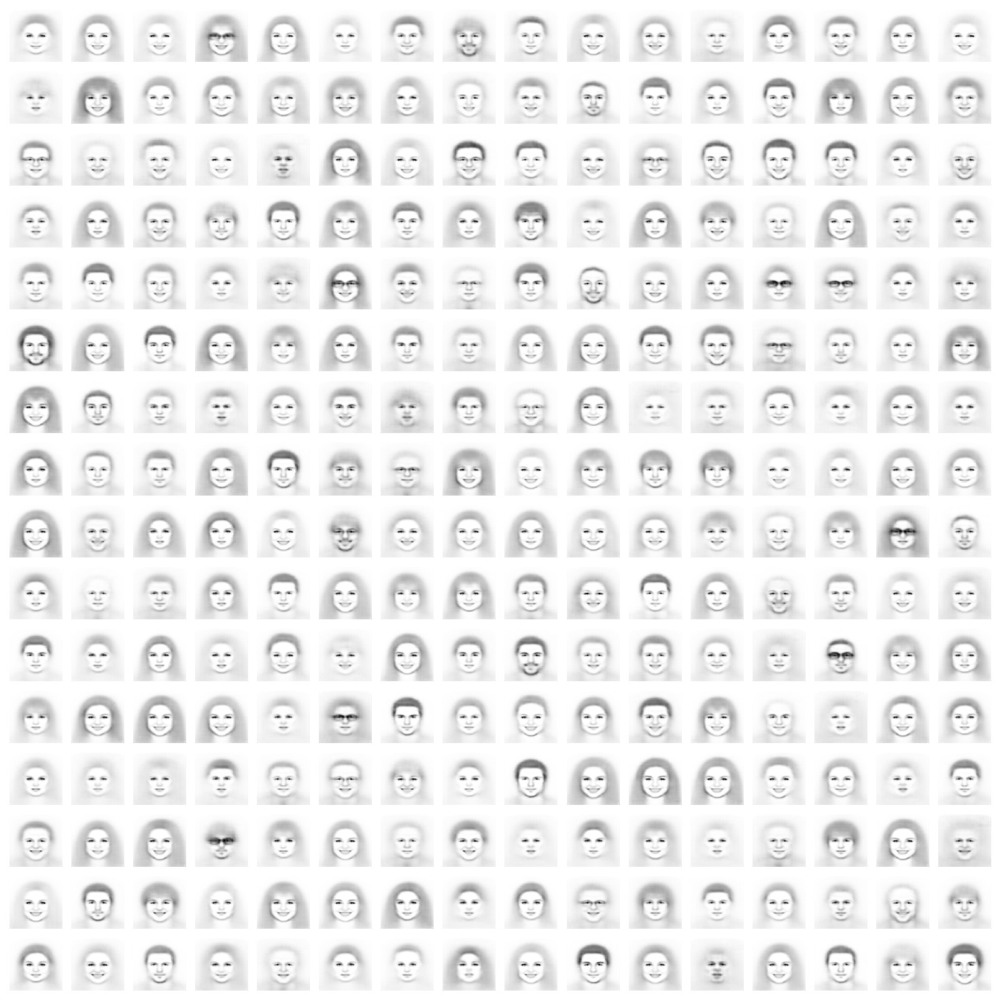
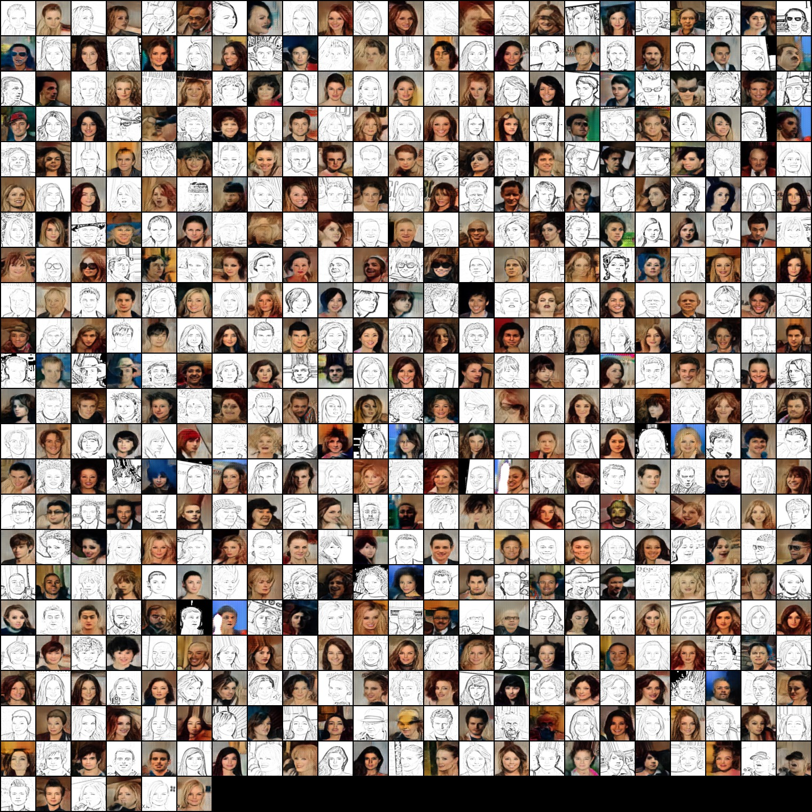

### **Text2Sketch2Face** Project

#### **Project Overview**
This project focuses on generating sketches from textual descriptions and further refining those sketches into realistic human faces. The work is inspired by forensic sketch artists, aiming to develop an automated system that transforms text descriptions into detailed sketches and eventually into realistic facial images.

#### **Results**:

**1. Text to Sketch Generation:**
   This image shows the output of the model from text descriptions to sketches.

   

**2. Sketch to Realistic Face Generation:**
   The second step involves translating the generated sketches into realistic facial images.

   

#### **Key Features**:
1. **Parallel LLM Pipeline**:
   - Four inference paths to efficiently extract multiple facial attributes from text inputs.
2. **Conditional Variational Autoencoder (CVAE)**:
   - Used for generating base facial sketches from the attributes extracted.
3. **Conditional GAN (CGAN)**:
   - Refines the sketches to include high-fidelity facial details.
4. **Image Translation Techniques**:
   - Experimentation with supervised methods like **Pix2Pix** and unsupervised methods like **CycleGAN** for translating sketches into realistic faces.

#### **Directory Structure**:
```
├── Experiments
│   ├── Dakshinya             # Experiment 1: Dakshinya's models and results
│   └── Hemang Pix2Pix        # Experiment 2: Hemang’s Pix2Pix implementation
└── models
    ├── cvae-gans             # CVAE and GAN models
    │   ├── results
    │   └── utils
    ├── cycle-gans            # CycleGAN models and results
    │   └── results
    ├── llm_pipeline          # Large Language Model pipeline code and scripts
    └── Text2Sketch_BaseGAN   # Base GAN for text-to-sketch generation
        └── results
```

---


